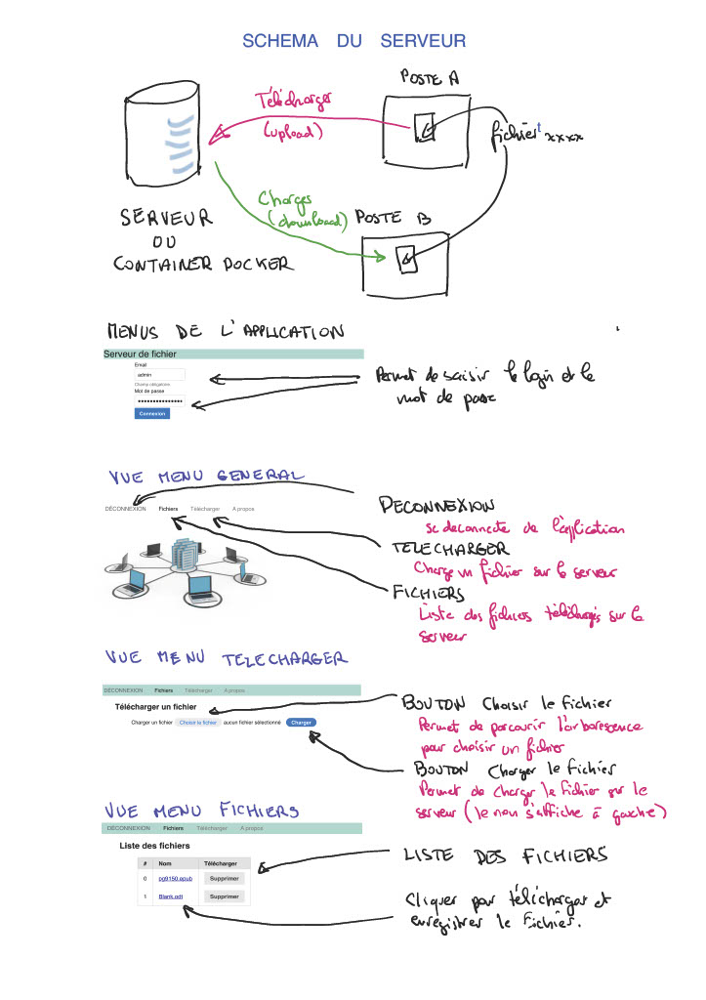

# f3serv

Mini serveur de chargement et téléchargement de fichier

## Technologies utilisées

- HTML
- CSS avec Pure Css (https://purecss.io/)
- PHP avec le framework Fat Free Framework (https://fatfreeframework.com/)

## Installation

1. Clonez ce dépôt : `git clone https://github.com/phantoine/f3serv
2. Ouvrez index.php dans votre navigateur.

## Auteur

Philippe ANTOINE - phantoine@etik.com

## Description

#### Mini serveur de fichier écrit avec Fat Free Framework et pure Css

Ce serveur permet de charger un fichier dans le répertoire files (menu Télécharger) et permet de le récupérer sur une autre machine (menu Fichiers) en cliquanr sur le nom du fichier.

Il est possible également de le supprimer du répertoire "files" une fois le téléchargment réalisé.

L'authentification se fait depuis une base de type fichier (driver Jig) contenu dans le fichier Users du répertoire data.

Le fichier putuse.php permet de modifier le mot de passe qui est codé en md5 dans le fichier Users.

Par défaut le login est "admin" et le mot de passe est "123". Il suffit de modifier le fichier putuse.php en modifiant le mot de passe et de lancer putuse.php.

## Utilisation dans un conteneur Docker

Utiliser le fichier dockerfile pour créer une image docker:

_docker build -t f3serv ._

Le nom de l'image s'appelle f3serv
Pour créer un conteneur et lancer le serveur sur le port 8085:

_docker run -p 8085:8085 f3serv_

Le serveur fonctionne localement en lançant **http://localhost:8085**

